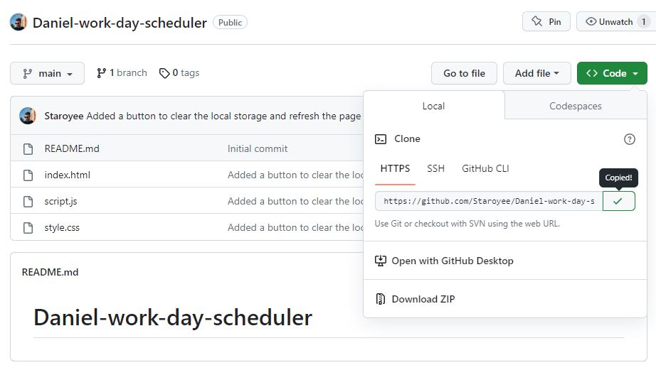
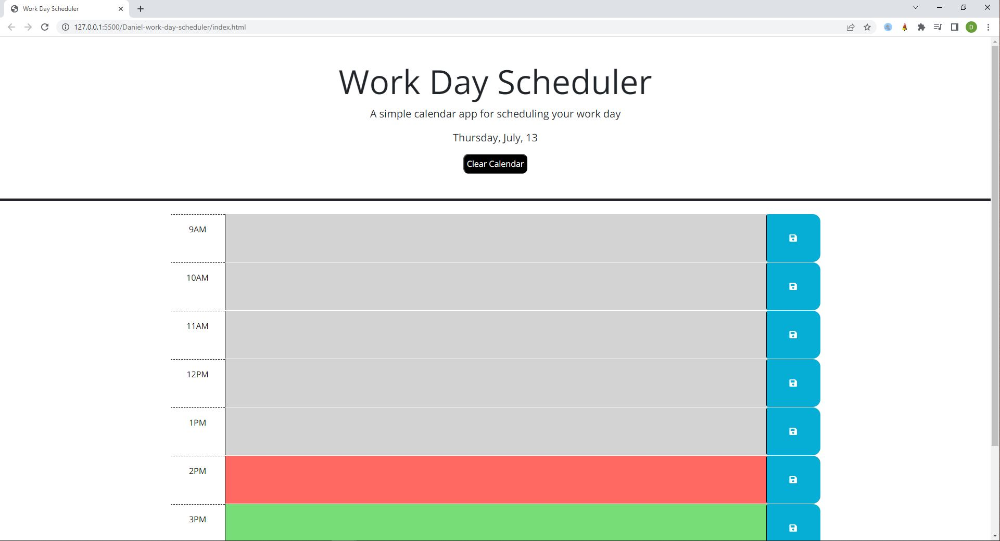

# Daniel-work-day-scheduler

## Description
I was tasked to create a functional work-day-scheduler to allow users to enter calendar events which persist when the page is refreshed or re-loaded, and also keeps track of the date, time and presents each hour as a different colour for past, present and future.

I was motivated to undertake this task because I wished to gain a greater understanding of how to use JQuery and dayjs to power a website.

## Solve
The completion of this project provides the user with a functional calendar indicating the current date, and allows the user to enter descriptions in each hour of the day which save and display even after closing and reopening the page. The hour sections should also change colour depending on the time of day(past, present, future.).

The webpage is now deployed for use.

## I have learned:
* How to use JQuery to target elements in a HMTL doc using the id or class name.
* How to use JQuery to add event listeners to elements.
* How to use JQuery to manipulate the DOM.
* How to use JQuery to access element siblings and parents.
* How to use JQuery to add attributes, classes, and ids.
* How to use Dayjs to give a variable the current time value in 24 hour time format.
* How to use Dayjs to give a variable the current date in different formats, then pass the value to a HTML element to display it on the webpage.

## Installation
Steps to install this project on your local PC
1. Open the termal on your machine.
2. Use the terminal command `cd` to navigate to the directory where we want the repository located.
3. Locate the 'Code' button on the 'Daniel-work-day-scheduler' github repository, click it, then copy the 'HTTPS' link to clipboard. (See image)

4. Use the git command `git clone` followed by the URL copied from Github to clone the repo to our machine.
5. The `git clone` command creates a new directory with the same name as the repository. We navigate into our new directory using `cd`.
6. The repository should now be cloned onto your device and able to be edited in VScode or another editing software.

## Instructions

To use the site:
1. Enter description into text areas on the calendar.
2. Press the save button on the corresponding text area.
3. Press the 'Clear Calendar' button to empty the calendar of descriptions.
4. View the date at the top of the page.
5. The colors of each hour section represents whether the hour is in the past, present, or future. (Past = grey | Present = red | Future = green)

## Deployed Application Link
* https://staroyee.github.io/Daniel-work-day-scheduler/

## Screenshot

## Credits
* https://developer.mozilla.org/en-US/docs/Web/JavaScript/Reference/Operators/Less_than_or_equal
* https://developer.mozilla.org/en-US/docs/Web/JavaScript/Reference/Statements/if...else
* https://developer.mozilla.org/en-US/docs/Web/JavaScript
* https://day.js.org/docs/en/display/format
* https://day.js.org/docs/en/display/display
* https://www.digitalocean.com/community/tutorials/how-to-modify-attributes-classes-and-styles-in-the-dom
* https://day.js.org/docs/en/get-set/hour
* https://day.js.org/en/
* https://meetanshi.com/blog/reload-current-page-without-losing-any-form-data-in-javascript/
* https://www.javascripttutorial.net/javascript-dom/javascript-siblings/